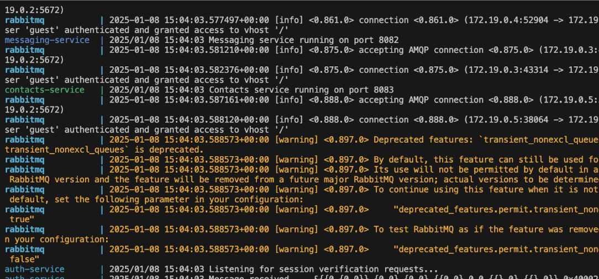
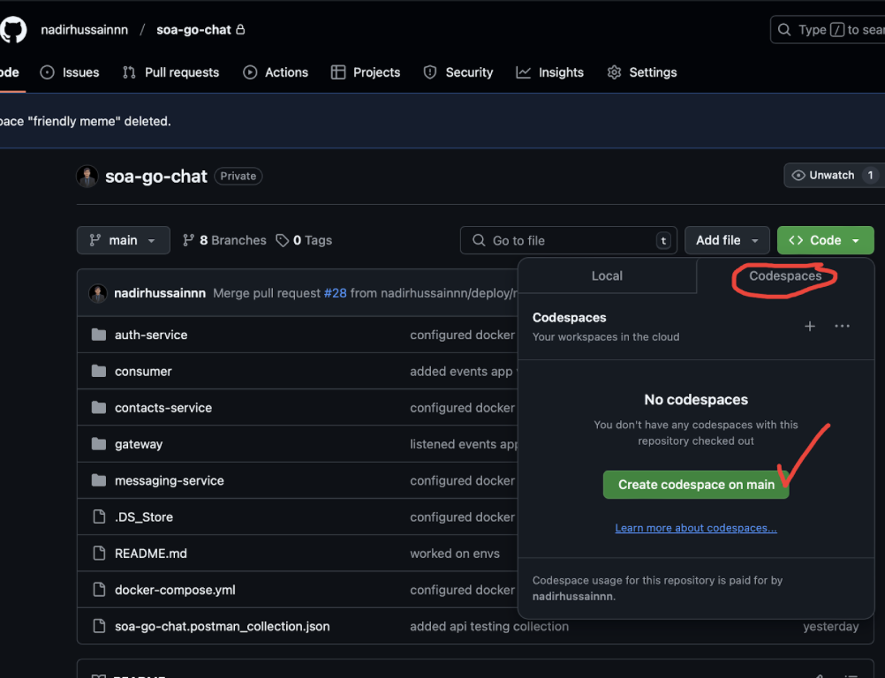
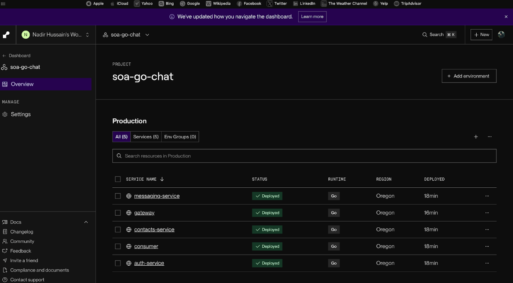

# GO-CHAT: An SOA-based chat app built in Go lang

**Instructions to compile and Run project**

- Install latest version of docker desktop on your machine
- Then extract the source_code folder (You will see 5 folders, 1 .yml file, 1 .json file and 1 .md within source_code folder) 
- At that (root) level, run

```markdown
docker-compose up --build
```

- It may take a few mins to build and set UP containers for services. 
- Once it is finished, you should see something like this



That means, the build was successful, all services are UP and running

You can now access the frontend site on
http://localhost:8085/


**Instructions to deploy the project**

The dockerized app can be hosted on github codespace, render, aws or anywhere with just few clicks.
For exp: You can upload the source_code to your github (all folders in single repo), and then see this option and create codespace deployment. You will need to run this command on terminal of codespace at root level

```markdown
docker-compose up --build
```



Alternatively, we can deploy on render.com each service separately and configure envs accordingly. As done here




The project demo is already shown in Project Report.pdf